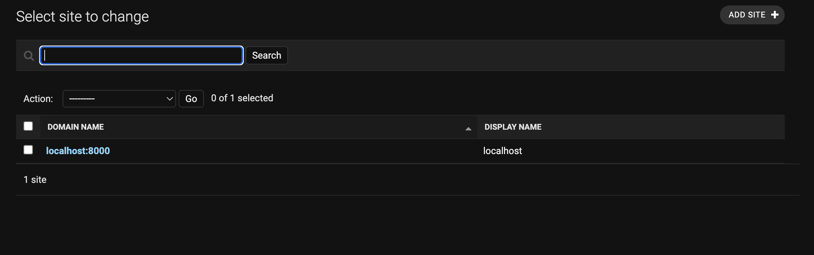
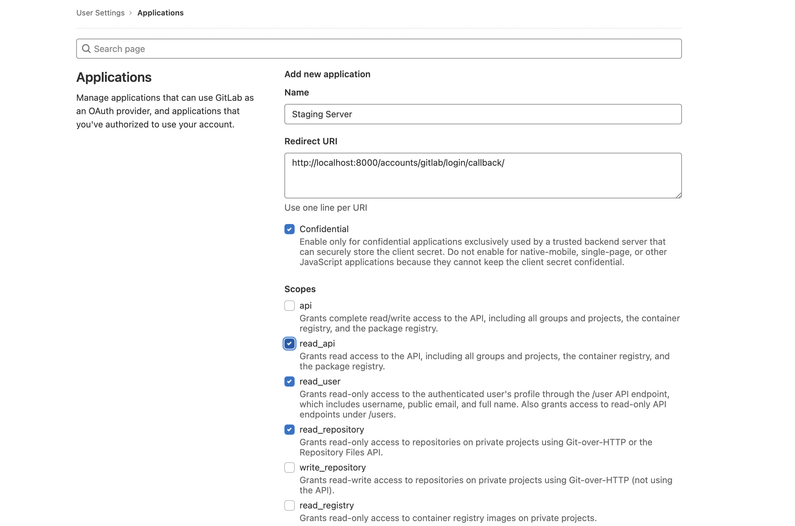
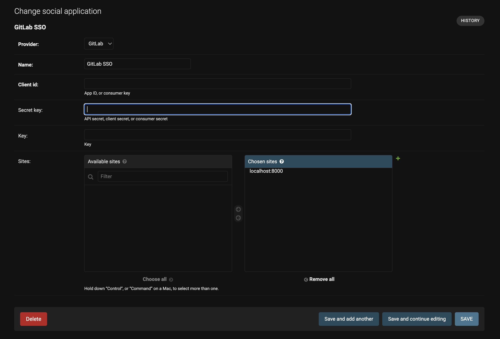
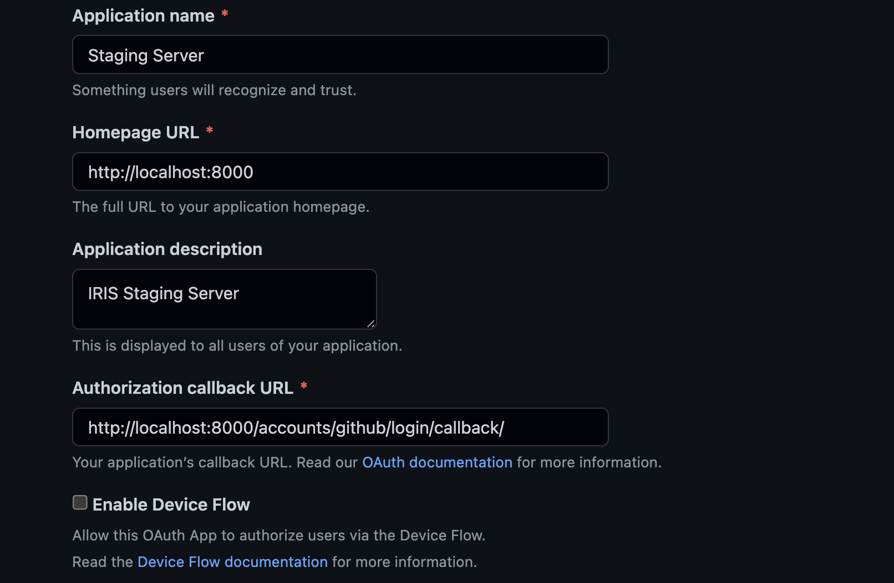
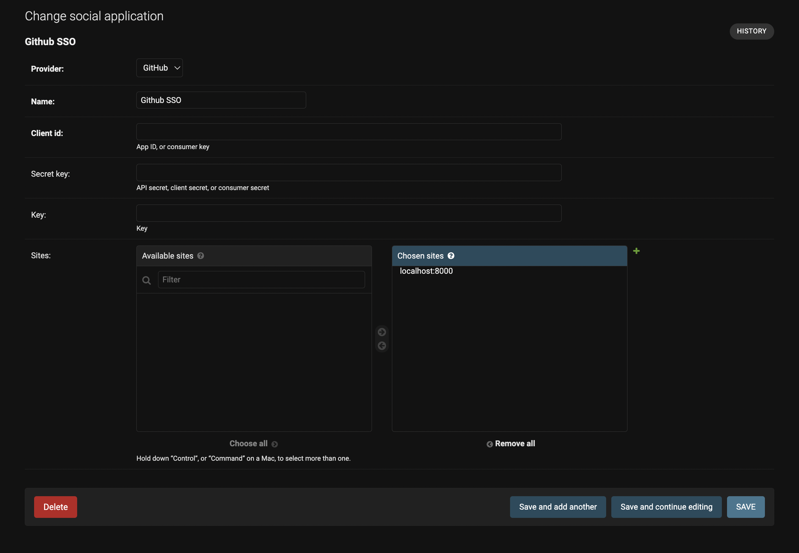

# Staging Server

## Table of Contents
- [Staging Server](#staging-server)
  - [Table of Contents](#table-of-contents)
  - [Setup Instructions For Local](#setup-instructions-for-local)

    - [1. Repository cloning](#1-Repository cloning)
    - [2. Create and activate virtual environment](#2-create-and-activate-virtual-environment)
    - [3. Install dependencies](#3-install-dependencies)
    - [4. Run migrations](#4-run-migrations)
    - [5. Create superuser](#5-create-superuser)
    - [6. Run the app and log in as superuser](#6-run-the-app-and-log-in-as-superuser)
    - [7. Update site name](#7-update-site-name)
    - [8. Add social applications](#8-add-social-applications)
      - [8.1  Add GitLab SSO](#81--add-gitlab-sso)
      - [8.2 Add Github SSO](#82-add-github-sso)
    - [9. Celery Setup](#9-celery-setup)

# DEPRECATED INSTRUCTIONS 
## Setup Instructions For Local
### 1. Repository cloning
> `git clone https://<your_username>@git.iris.nitk.ac.in/iris-teams/systems-team/staging-server.git`

  Example:
  > `git clone https://wasey_08@git.iris.nitk.ac.in/iris-teams/systems-team/staging-server.git`

### 2. Create and activate virtual environment
> `cd staging-server`

> `sudo apt install python3-venv python3-pip redis`

> `pip install virtualenv` 
 
> `python3 -m venv <virtual-environment-name>`   Example:
  > `python3 -m venv staging`
  
> `source <virtual-environment-name>/bin/activate`   Example:
  > `source staging/bin/activate`

### 3. Install dependencies
> `install docker and nginx, follow up the link given below`

Links

> for docker installation click [here](https://docs.docker.com/get-docker/)

> add sudo user to the docker group, to run docker without sudo command. Follow up this [link](https://docs.docker.com/engine/install/linux-postinstall/)

> for nginx installation click [here](https://www.nginx.com/resources/wiki/start/topics/tutorials/install/)

> `pip/pip3 install -r requirements.txt`

> `cp .env.example .env`

> `docker login git-registry.iris.nitk.ac.in -u <gitlab-username> -p <personal-access-token>`

Make changes in some files

1. stagingserver/settings.py

  > Change `ASGI_APPLICATION = 'stagingserver.routing.application'` to `ASGI_APPLICATION = 'stagingserver.asgi.application'`

2. stagingserver/asgi.py

  > delete the whole content of asgi.py and add these lines

    import os

    from django.core.asgi import get_asgi_application

    os.environ.setdefault('DJANGO_SETTINGS_MODULE', 'stagingserver.settings')
    application = get_asgi_application()

3. add/move some files to nginx for serving static files used in the website 

  > `move deploy/template.conf` to `/etc/nginx/sites-available/`

  > go to this [link](https://git.iris.nitk.ac.in/iris-teams/systems-team/staging-server/-/wikis/nginx-templates) and add those two conf files to /etc/nginx/sites-available/

  > create a syslink for those files which is added in nginx/sites-available/ directory. Example `sudo ln -s /etc/nginx/sites-available/template.conf /etc/nginx/sites-enabled/` do the same for other conf file by changing the name in the command 

  > in staging.conf replace this `alias /home/systems/staging-server/assets/;` with the actual patch of your assets directory. Example: `alias /home/w453y/staging-server/assets/;`

  4. configure .env file, can refer to the example given below

    
    PATH_TO_HOME_DIR="/home/w453y"
    
    CSRF_ALLOWED_HOSTS="https://%2A.staging.iris.nitk.ac.in%2Chttps//*.127.0.0.1,https://10.15.65.45,https://0.0.0.0"
    
    ALLOWED_HOSTS="staging.iris.nitk.ac.in,localhost,127.0.0.1,10.15.65.45,0.0.0.0"

    NGINX_ADD_CONFIG_SCRIPT_PATH="/home/w453y/staging-server/scripts/nginx_add_config.sh"
    
    NGINX_REMOVE_SCRIPT="/home/w453y/staging-server/scripts/nginx_remove_config.sh"
    
    NGINX_ADD_CONFIG_SCRIPT_IRIS="/home/w453y/staging-server/scripts/nginx_add_config_IRIS.sh"
    
    NGINX_ADD_CONFIG_SCRIPT_IRIS_PATH="/home/w453y/staging-server/scripts/nginx_add_config_IRIS.sh"
    
    HOST_PARENT_WD="/home/w453y/staging-server"
    
    DEPLOYMENT_DOCKER_NETWORK="IRIS"
    
    PREFIX="staging"
    
    DOCKER_DB_IMAGE="mysql:5.7"
    
    DOCKER_IMAGE="git-registry.iris.nitk.ac.in/iris-teams/systems-team/staging-server/dev-iris:4.3.2"
    
    SUBDOMAIN_PREFIX="staging"
    
    DOMAIN="iris.nitk.ac.in"

    REDIS_HOST=127.0.0.1
    
    REDIS_PORT=6379
    
    DOCKER_SOCKET_HOST="socat"

### 4. Run migrations
> `python manage.py makemigrations`
> `python manage.py migrate`

### 5. Create superuser
> `python manage.py createsuperuser`

### 6. Run the app and log in as superuser
> `python manage.py runserver`

> In development mode, use --insecure flag to make django provide the static assets. 

The app will be visible on [http://localhost:8000](http://localhost:8000)

Go to [http://localhost:8000/admin](http://localhost:8000/admin)

### 7. Update site name
Click on **Sites** then click on the existing site. Rename as shown and click **SAVE**

### 8. Add social applications
#### 8.1  Add GitLab SSO
  * Go to User Settings > Applications then create an application as shown
    
  * Copy the Application ID and Secret from GitLab into Client ID and Secret key 
  * Double click on [localhost:8000](http://localhost:8000) to move it into **Chosen sites** and click **SAVE**
    

#### 8.2 Add Github SSO
* Go to Settings > Developer Settings > OAuth Apps > New OAuth App and fill as shown
  
* Copy the Client ID and a Client secret from Github into Client ID and Secret key
* Double click on [localhost:8000](http://localhost:8000) to move it into **Chosen sites** and click **SAVE**
  

### 9. Celery Setup
In another terminal in the root of your project directory, run the following command:
> `celery -A "name_of_project" worker -l info` ( by default name_of_project = stagingserver )
