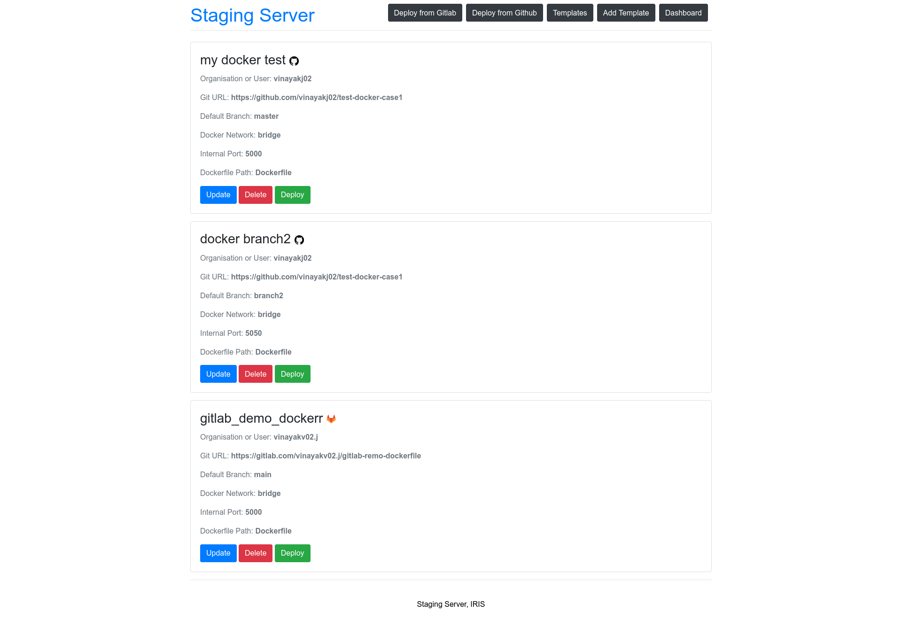
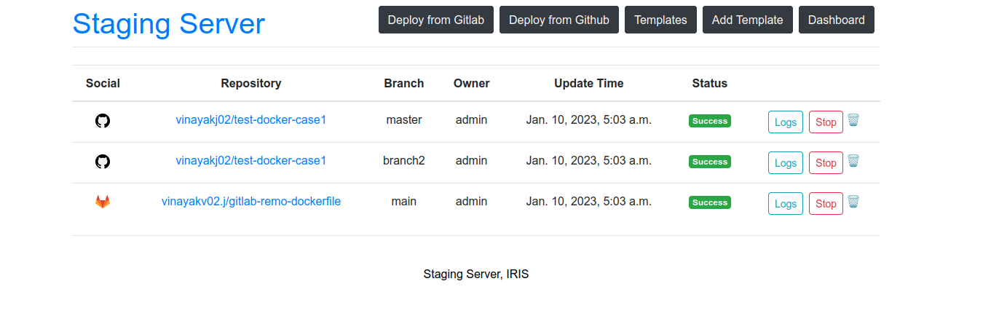

## Templates

Templates can be used to deploy predefined configurations of services. 

### Creating a new template

To create a new template, click on the [`Add Template`](http://localhost:8000/deploy_template_new/) button from any page. This will take you to the template form page. Fill in the details of the template and click on `Save` button. This will take you to the [`Templates`](http://localhost:8000/deploy_template_list), which lists all the templates. 
 

## Deploying a template

To deploy a template, click on the `Deploy` button. They can be deleted or edited to change configs. After editing the template, it needs to be saved and deployed again for the changes to show up. 

## Dashboard 
The instances of deployed templates can be found in the dashboard.
 

