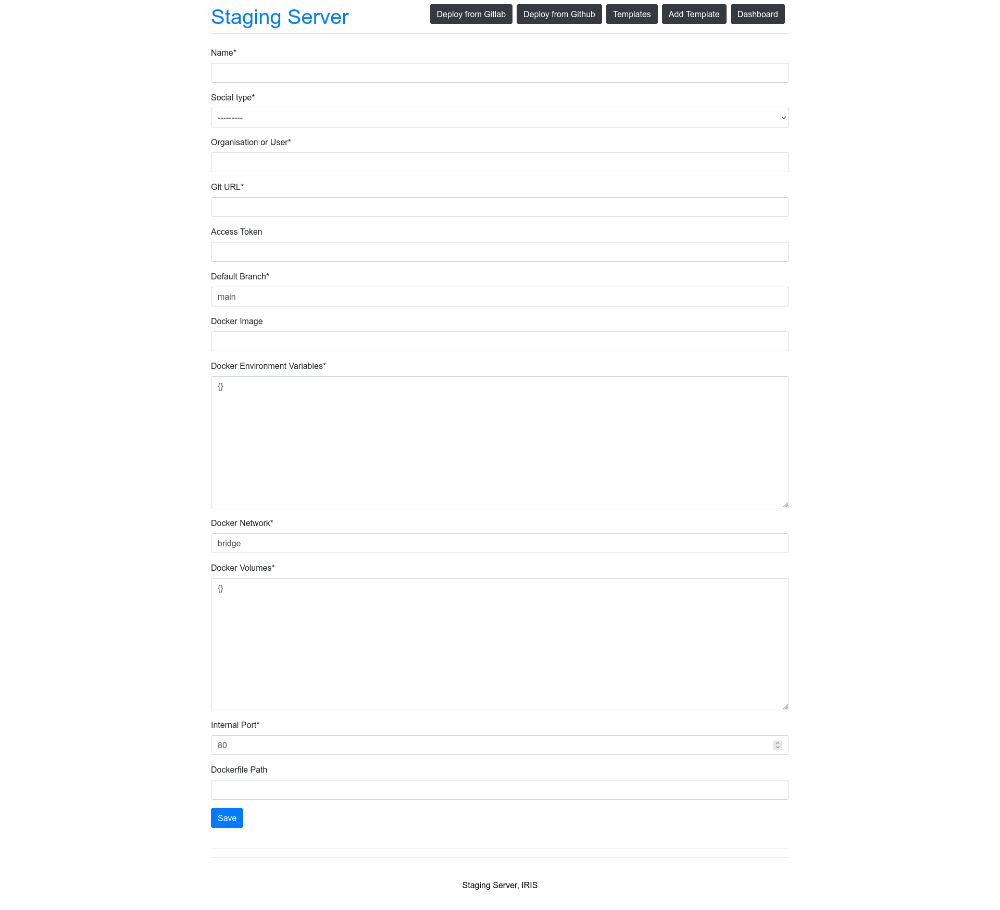

## Templates

### Adding a new template

To add a new template, click on the `Add Template` button on the homepage. This will take you to the template form page. Fill in the details of the template and click on `Save` button. This will take you to the homepage which lists all the templates.

Form fields
- [model](../main/models.py)
- [form](../main/forms.py)
